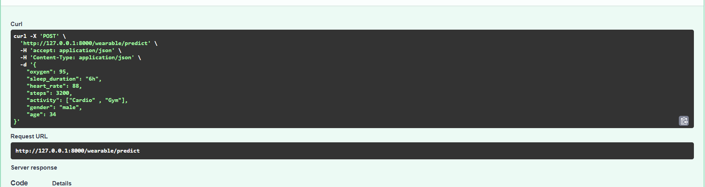
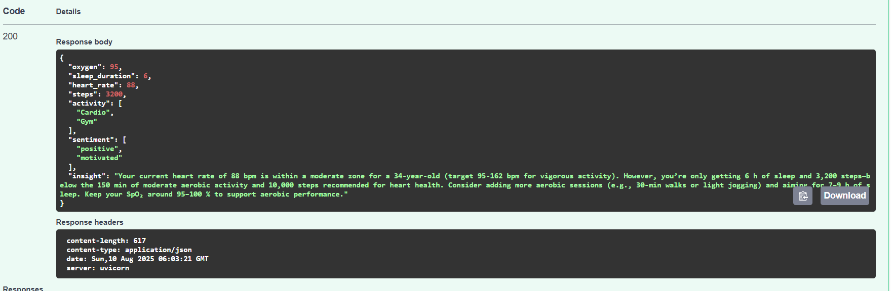
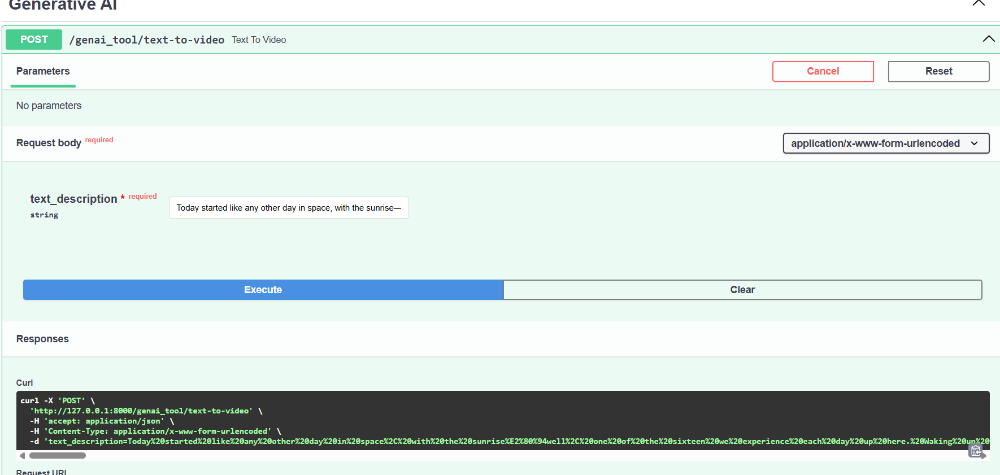
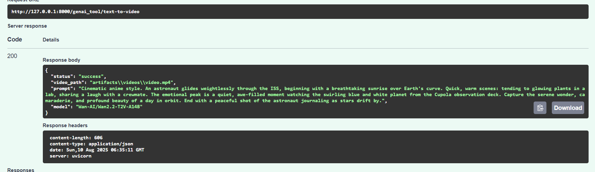

# Journal Text Sentiment , Voice and Wearable Sentiment Analysis


## API Endpoint

### POST `/text/predict`

This endpoint accepts a JSON payload with a journal text string and returns the sentiment scores for different emotions.

#### Request

- **Content-Type:** `application/json`
- **Body:**

```json
{
  "text": "I didn't feel humiliated, which was a surprise to me, considering the circumstances that had just unfolded, and as I reflected on it, I realized that it was a testament to my growth and resilience, and it made me think about all the times I had felt humiliated in the past, and how it had affected me, and I had to admit that it was a pretty terrible feeling, and one that I didn't wish on anyone, but at the same time, I was grateful that I had been able to navigate this situation without feeling that way, and it made me wonder if I had finally reached a point where I was comfortable with myself, and wasn't as concerned with what others thought of me, and that was a pretty liberating feeling, and it made me think about the concept of humiliation, and how it can be used as a tool to control and manipulate people, and how it can be used to make someone feel small and powerless, and it was interesting to me that I had been able to avoid feeling that way, even in a situation where I could have easily felt that way, and it made me feel a sense of pride and accomplishment, and it was a good feeling, but at the same time, it was also a bit of a confusing feeling, because I wasn't sure if I should be feeling proud of myself for not feeling humiliated, or if I should be feeling concerned that I wasn't feeling humiliated, and that maybe I should be feeling more emotional, and it was a weird feeling, not knowing how to process it, but as I sat there, thinking about it, I realized that maybe it was okay to just feel okay, and not feel the need to analyze it too much, and maybe it was just a sign that I was healing, and moving forward, and that was a good thing, and I felt a sense of sadness wash over me, not because I was humiliated, but because I had wasted so much time in the past letting other people's opinions dictate how I felt about myself, and I had let their words and actions have so much power over me, and it was a sad thing to think about, but it was also a liberating thing, because it meant that I had the power to change, and to move forward, and to not let those things affect me anymore, and that was a really good feeling, and it was a feeling that I was grateful for, and it was a reminder that I was strong, and capable, and resilient, and that I could get through anything, and that was a wonderful feeling, and one that I would carry with me for a long time."
}
```

#### Example cURL Command

```bash
curl -X 'POST' \
  'http://127.0.0.1:8000/text/predict' \
  -H 'accept: application/json' \
  -H 'Content-Type: application/json' \
  -d '{
  "text": "I didn'\''t feel humiliated, which was a surprise to me, considering the circumstances that had just unfolded, and as I reflected on it, I realized that it was a testament to my growth and resilience, and it made me think about all the times I had felt humiliated in the past, and how it had affected me, and I had to admit that it was a pretty terrible feeling, and one that I didn'\''t wish on anyone, but at the same time, I was grateful that I had been able to navigate this situation without feeling that way, and it made me wonder if I had finally reached a point where I was comfortable with myself, and wasn'\''t as concerned with what others thought of me, and that was a pretty liberating feeling, and it made me think about the concept of humiliation, and how it can be used as a tool to control and manipulate people, and how it can be used to make someone feel small and powerless, and it was interesting to me that I had been able to avoid feeling that way, even in a situation where I could have easily felt that way, and it made me feel a sense of pride and accomplishment, and it was a good feeling, but at the same time, it was also a bit of a confusing feeling, because I wasn'\''t sure if I should be feeling proud of myself for not feeling humiliated, or if I should be feeling concerned that I wasn'\''t feeling humiliated, and that maybe I should be feeling more emotional, and it was a weird feeling, not knowing how to process it, but as I sat there, thinking about it, I realized that maybe it was okay to just feel okay, and not feel the need to analyze it too much, and maybe it was just a sign that I was healing, and moving forward, and that was a good thing, and I felt a sense of sadness wash over me, not because I was humiliated, but because I had wasted so much time in the past letting other people'\''s opinions dictate how I felt about myself, and I had let their words and actions have so much power over me, and it was a sad thing to think about, but it was also a liberating thing, because it meant that I had the power to change, and to move forward, and to not let those things affect me anymore, and that was a really good feeling, and it was a feeling that I was grateful for, and it was a reminder that I was strong, and capable, and resilient, and that I could get through anything, and that was a wonderful feeling, and one that I would carry with me for a long time."
}'
```

***

## Response

The response returns a JSON object with:
## Example Response
```
{
"scores": {
"sadness": -0.03000987134873867,
"joy": 0.09970700740814209,
"love": 0.12099681049585342,
"anger": -0.10828430950641632,
"fear": 0.24226462841033936,
"surprise": 0.125854030251503
},
"top_label": "fear",
"top_score": 0.24226462841033936
}
```
### Explanation

- The `scores` represent raw model logits for each emotion category.
- The `top_label` indicates the predominant emotion detected in the input text.
- The `top_score` is the raw logit value associated with the predominant emotion.

***

## Example Images


- The model expects journal text input and outputs sentiment scores across emotions: sadness, joy, love, anger, fear, surprise.
- The API runs locally at `http://127.0.0.1:8000`.
- You can interact with the endpoint via HTTP clients like cURL or Postman.
- The model performs chunking on inputs longer than 512 characters internally.


### 2. Voice Emotion Classification

#### POST `/voice/post`

This endpoint accepts an audio file (e.g., WhatsApp audio, `.opus`, or `.ogg`) and returns scores for various emotions detected in the voice sample.

**Request:**
- **Content-Type:** `multipart/form-data`
- **Body:** File upload (`file` parameter)

**Example cURL:**
```
curl -X 'POST' \
  'http://127.0.0.1:8000/voice/post' \
  -H 'accept: application/json' \
  -H 'Content-Type: multipart/form-data' \
  -F "file=@WhatsApp Audio 2025-08-03 at 10.12.54_29098a5c.wa.opus;type=audio/ogg"
```

**Response Example:**
```
{
  "Anger": 0.0,
  "Calm": 0.007,
  "Disgust": 0.005,
  "Fear": 0.001,
  "Happy": 0.004,
  "Neutral": 0.981,
  "Sad": 0.0,
  "Surprised": 0.001
}
```

**Response Interpretation:**
- Each field represents the detected probability or score for a particular emotion. In the above response, `"Neutral"` dominates, indicating a neutral emotional tone.

---


## Example Images


---


# Wearable Data Health Insight API

## API Endpoint

### POST `/wearable/predict`

This endpoint accepts a JSON payload with physiological and activity data from a wearable device and returns health insights, along with motivational sentiment analysis.

#### Request

- **Content-Type:** `application/json`
- **Body:**

```json
{
  "oxygen": 95,
  "sleep_duration": "6h",
  "heart_rate": 88,
  "steps": 3200,
  "activity": ["Cardio", "Gym"],
  "gender": "male",
  "age": 34
}
```

#### Example cURL Command

```bash
curl -X 'POST' \
  'http://127.0.0.1:8000/wearable/predict' \
  -H 'accept: application/json' \
  -H 'Content-Type: application/json' \
  -d '{
  "oxygen": 95,
  "sleep_duration": "6h",
  "heart_rate": 88,
  "steps": 3200,
  "activity": ["Cardio", "Gym"],
  "gender": "male",
  "age": 34
}'
```

***

## Response

The response returns a JSON object with your metrics, detected sentiment, and personalized health insights.

### Example Response

```
{
  "oxygen": 95,
  "sleep_duration": 6,
  "heart_rate": 88,
  "steps": 3200,
  "activity": [
    "Cardio",
    "Gym"
  ],
  "sentiment": [
    "positive",
    "motivated"
  ],
  "insight": "Your current heart rate of 88 bpm is within a moderate zone for a 34-year-old (target 95–162 bpm for vigorous activity). However, you're only getting 6 h of sleep and 3,200 steps—both below the 150 min of moderate aerobic activity and 10,000 steps recommended for heart health. Consider adding more aerobic sessions (e.g., 30-min walks or light jogging) and aiming for 7–9 h of sleep. Keep your SpO2 around 95–100% to support aerobic performance."
}
```

### Explanation

- **oxygen, sleep_duration, heart_rate, steps, activity**: Echoes the input data.
- **sentiment**: Describes the model's read on motivational or emotional tone.
- **insight**: Text generated by the model, with actionable recommendations based on your metrics.

***

## Example Images





# Text-to-Video Generation API

### POST `/genai_tool/text-to-video`

This endpoint creates a video clip from a textual description, supporting cinematic or narrative prompts (e.g., for anime scenes, cinematic sequences, or story visualization).

#### Request

- **Content-Type:** `application/x-www-form-urlencoded`
- **Body:**  
  - `text_description` (string): The prompt describing the scenario, scene, or script you want visualized as a video.

```json
{
  "text_description": "Cinematic anime style. An astronaut glides weightlessly through the ISS, beginning with a breathtaking sunrise over Earth's curve. Quick, warm scenes: tending to glowing plants in a lab, sharing a laugh with a crewmate. The emotional peak is a quiet, awe-filled moment watching the swirling blue and white planet from the Cupola observation deck. Capture the serene wonder, camaraderie, and profound beauty of a day in orbit. End with a peaceful shot of the astronaut journaling as stars drift by."
}
```

#### Example cURL Command

```bash
curl -X 'POST' \
  'http://127.0.0.1:8000/genai_tool/text-to-video' \
  -H 'accept: application/json' \
  -H 'Content-Type: application/x-www-form-urlencoded' \
  -d 'text_description=Today started like any other day in space, with the sunrise—a well-worn scene for the sixteen we experience each day up here. Making our way through the morning checklist on the ISS, tending to plants, peering down at the blue marble. I laughed with my crewmate over our growing experiment, and as we watched the Earth swirl below from the Cupola, it hit me: awe, peace, a reminder of why I journal. Tonight, I'll watch the stars drift by."
```

***

## Response

The response is a JSON object indicating status and providing a path to the generated video.

### Example Response

```
{
  "status": "success",
  "video_path": "artifacts\\videos\\video.mp4",
  "prompt": "Cinematic anime style. An astronaut glides weightlessly through the ISS, beginning with a breathtaking sunrise over Earth's curve. Quick, warm scenes: tending to glowing plants in a lab, sharing a laugh with a crewmate. The emotional peak is a quiet, awe-filled moment watching the swirling blue and white planet from the Cupola observation deck. Capture the serene wonder, camaraderie, and profound beauty of a day in orbit. End with a peaceful shot of the astronaut journaling as stars drift by.",
  "model": "Man-AI/Mana2.2-T2V-A14B"
}
```

### Explanation

- **status**: Indicates if the operation succeeded.
- **video_path**: Relative path to the generated video output.
- **prompt**: The input scene/prompt description used.
- **model**: The generative model’s identifier.

***

## Example Images





--- 
Sample Output

<video width="640" height="360" controls>
  <source src="models/genai/videos/video.mp4" type="video/mp4">
</video>

----

# Text-to-Image Generation API

### POST `/genai_tool/text-to-image`

This endpoint creates an image from a textual description, supporting narrative or comic-style prompts for creative visualizations.

#### Request

- **Content-Type:** `application/x-www-form-urlencoded`
- **Body:**  
  - `text_description` (string): The prompt describing the scenario or concept you want visualized as an image.

```json
{
  "text_description": "Here is your weekly summary, presented as a manga-style comic strip. An astronaut floats peacefully before the large, sweeping window of the ISS. The face, full of quiet awe, is illuminated by the brilliant blue and white swirl of the Earth below..."
}
```

#### Example cURL Command

```bash
curl -X 'POST' \
  'http://127.0.0.1:8000/genai_tool/text-to-image' \
  -H 'accept: application/json' \
  -H 'Content-Type: application/x-www-form-urlencoded' \
  -d 'text_description=Here is your weekly summary, presented as a manga-style comic strip. An astronaut floats peacefully before the large, sweeping window of the ISS. The face, full of quiet awe, is illuminated by the brilliant blue and white swirl of the Earth below...'
```

***

## Response

The response is a JSON object indicating status and providing a path to the generated image.

### Example Response

```
{
  "status": "success",
  "image_path": "artifacts\\images\\image.png",
  "prompt": "Here is your weekly summary, presented as a manga-style comic strip...",
  "model": "gemini-2.0-flash-preview-image-generation"
}
```


## Example Images


